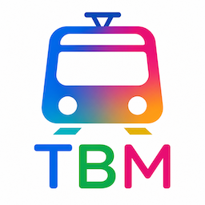
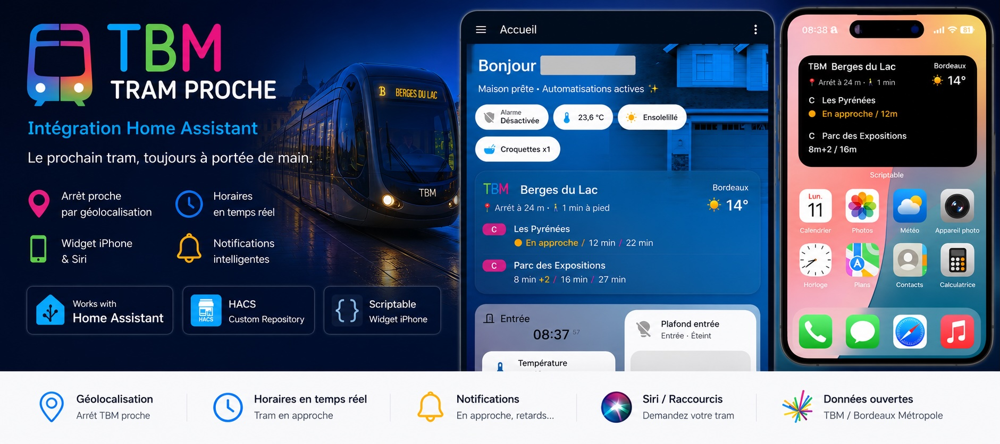
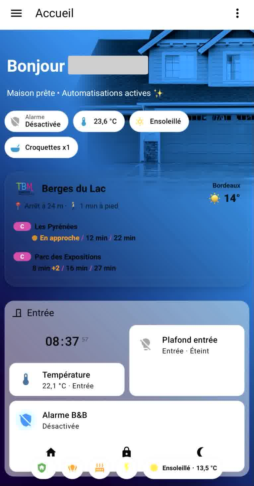
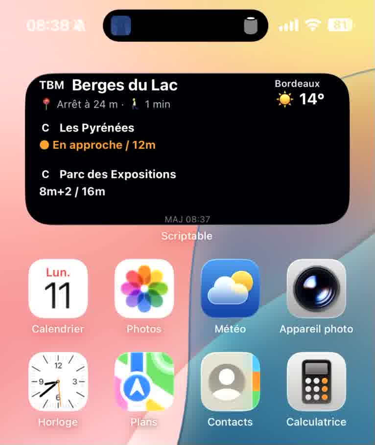

<h1 align="center">
  
  TBM Tram Proche
</h1>

<p align="center">
  
</p>


[](https://my.home-assistant.io/redirect/hacs_repository/?owner=benoit-ha33&repository=tbm_tram_proche)

Intégration Home Assistant pour afficher les prochains passages TBM autour de soi en temps réel.

## Fonctionnalités

- Détection de l’arrêt TBM le plus proche
- Prochains passages en temps réel
- Lignes et destinations
- Couleurs des lignes tram
- Retards et annulations
- Affichage “En approche”
- Distance jusqu’à l’arrêt
- Temps estimé à pied
- Capteur résumé pour widget iPhone / Siri
- Compatible HACS

## Captures d’écran

<p align="center">
  
  
</p>

## Fonctionnement

L’intégration utilise la géolocalisation Home Assistant pour détecter automatiquement l’arrêt TBM le plus proche.

Les données récupérées incluent :

- Prochains passages en temps réel
- Retards
- Annulations
- Temps à pied jusqu’à l’arrêt
- Distance jusqu’à l’arrêt
- Destinations des trams
- Statut “En approche”

L’intégration crée également un capteur résumé optimisé pour les widgets iPhone et Siri.

## Prérequis

Avant l’installation :

### Home Assistant

- Home Assistant 2024+
- Application mobile Home Assistant installée
- Géolocalisation activée sur le téléphone
- `device_tracker` fonctionnel

### HACS

Pour une installation simple :

- HACS installé : https://hacs.xyz/

Ajouter ensuite ce dépôt comme dépôt personnalisé :

```text
https://github.com/benoit-ha33/tbm_tram_proche

```

Catégorie :

```text
Integration
```

### Cartes Lovelace recommandées

Pour reproduire le dashboard présenté dans les captures, installer via HACS :

- Mushroom Cards
- Bubble Card
- Card Mod
- Button Card
- Layout Card (optionnel)

### iPhone

Pour les widgets iPhone :

- Application Scriptable
- Application Raccourcis Apple
- Home Assistant Cloud (Nabu Casa) recommandé

### Permissions recommandées

#### Application Home Assistant

- Localisation :
  - Toujours autoriser
  - Position précise activée
- Actualisation en arrière-plan activée

#### Scriptable

- Désactiver le mode économie d’énergie
- Ouvrir régulièrement Scriptable pour améliorer les refresh widgets

## Installation manuelle

Copier le dossier :

```text
custom_components/tbm_tram_proche
```

dans :

```text
/config/custom_components/
```

Puis redémarrer Home Assistant.

## Configuration

Dans Home Assistant :

```text
Paramètres → Appareils et services → Ajouter une intégration
```

Chercher :

```text
TBM Tram Proche
```

## Entités créées

- `sensor.tbm_arret_tram_proche`
- `sensor.tbm_distance_arret_tram`
- `sensor.tbm_prochains_passages`
- `sensor.tbm_resume_iphone`

## Siri

Exemple :

```text
Dis Siri, prochain tram
```
## Exemple de carte Lovelace

Cette carte utilise `custom:button-card`.

Ajouter manuellement ce YAML dans une carte Lovelace `Manual Card` pour reproduire le dashboard présenté dans les captures.

```yaml
type: custom:button-card
entity: sensor.tbm_prochains_passages
triggers_update:
  - sensor.tbm_prochains_passages
  - sensor.temperature_bordeaux
  - weather.meteo_france_forecast_for_city_bordeaux_aquitaine_33_fr_bordeaux
show_icon: false
show_name: false
show_state: false
custom_fields:
  content: |
    [[[
      const stop = entity.attributes.stop || "Arrêt inconnu";
      const distance = entity.attributes.distance || "?";
      const walking = entity.attributes.walking_minutes || "?";
      const departures = entity.attributes.departures || [];
      const logo = entity.attributes.entity_picture || "/local/tbm_tram_proche_images/tbm_logo.png";

      const tempState = states["sensor.temperature_bordeaux"]?.state;
      const temperature =
        tempState && tempState !== "unknown" && tempState !== "unavailable"
          ? tempState
          : "";

      const weatherState =
        states["weather.meteo_france_forecast_for_city_bordeaux_aquitaine_33_fr_bordeaux"]?.state || "";

      let weatherIcon = "☁️";

      if (weatherState === "sunny") weatherIcon = "☀️";
      else if (weatherState === "clear-night") weatherIcon = "🌙";
      else if (weatherState === "partlycloudy") weatherIcon = "⛅";
      else if (weatherState === "cloudy") weatherIcon = "☁️";
      else if (weatherState === "rainy") weatherIcon = "🌧️";
      else if (weatherState === "pouring") weatherIcon = "🌧️";
      else if (weatherState === "lightning") weatherIcon = "⛈️";
      else if (weatherState === "lightning-rainy") weatherIcon = "⛈️";
      else if (weatherState === "snowy") weatherIcon = "❄️";
      else if (weatherState === "snowy-rainy") weatherIcon = "🌨️";
      else if (weatherState === "fog") weatherIcon = "🌫️";
      else if (weatherState === "windy") weatherIcon = "💨";

      function formatTime(item) {
        if (item.cancelled) {
          return `<span class="cancelled">Annulé</span>`;
        }

        const min = item.minutes;
        const delay = item.delay || 0;

        let label = "";

        if (item.is_last) {
          label = min <= 2
            ? `<span class="last"><span class="last-dot"></span>Dernier tram</span>`
            : `<span class="last"><span class="last-dot"></span>Dernier tram ${min} min</span>`;
        } else if (min <= 2) {
          label = `<span class="approach"><span class="approach-dot"></span>En approche</span>`;
        } else {
          label = `${min} min`;
        }

        if (delay >= 2 && !item.cancelled) {
          label += ` <span class="delay">+${delay}</span>`;
        }

        return label;
      }

      let content = `
        <div class="header">
          <div class="left">
            <div class="title">
              
              <span>${stop}</span>
            </div>
            <div class="distance">📍 Arrêt à ${distance} m · 🚶 ${walking} min à pied</div>
          </div>

          <div class="weather">
            <div class="city">Bordeaux</div>
            <div class="temp">${weatherIcon} ${temperature}°</div>
          </div>
        </div>
      `;

      departures.forEach((item) => {
        const color = item.color || "#888";
        const times = (item.times || [])
          .map(t => formatTime(t))
          .join(` <span style="color:${color};">/</span> `);

        content += `
          <div class="row">
            <div class="top">
              <span class="badge" style="background:${color};">${item.line}</span>
              <span class="destination">${item.destination}</span>
            </div>
            <div class="times">${times}</div>
          </div>
        `;
      });

      return content;
    ]]]
styles:
  grid:
    - grid-template-areas: "\"content\""
    - grid-template-columns: 1fr
  card:
    - border-radius: 20px
    - padding: 14px
    - background: rgba(70,90,110,0.18)
    - border: 1px solid rgba(255,255,255,0.08)
    - box-shadow: 0 4px 14px rgba(0,0,0,0.16)
  custom_fields:
    content:
      - text-align: left
      - width: 100%
      - color: var(--primary-text-color)
extra_styles: |
  .header {
    display: flex;
    justify-content: space-between;
    align-items: flex-start;
    margin-bottom: 10px;
  }

  .weather {
    text-align: right;
    opacity: 0.9;
  }

  .city {
    font-size: 11px;
    font-weight: 600;
  }

  .temp {
    font-size: 18px;
    font-weight: 800;
  }

  .title {
    display: flex;
    align-items: center;
    gap: 8px;
    font-size: 17px;
    font-weight: 700;
    margin-bottom: 5px;
  }

  .logo {
    width: 40px;
    height: 26px;
    object-fit: contain;
    flex-shrink: 0;
  }

  .distance {
    font-size: 12px;
    opacity: 0.8;
  }

  .row {
    padding: 8px 0;
    border-bottom: 1px solid rgba(255,255,255,0.06);
  }

  .top {
    display: flex;
    align-items: center;
    gap: 6px;
    margin-bottom: 4px;
  }

  .badge {
    color: white;
    padding: 1px 7px;
    border-radius: 999px;
    font-size: 10px;
    font-weight: 800;
    min-width: 16px;
    text-align: center;
  }

  .destination {
    font-size: 12px;
    font-weight: 700;
  }

  .times {
    font-size: 12px;
    font-weight: 700;
    padding-left: 32px;
    opacity: 0.95;
  }

  .approach {
    color: #FF9800;
    font-weight: 800;
  }

  .approach-dot {
    display: inline-block;
    width: 8px;
    height: 8px;
    background: #FF9800;
    border-radius: 50%;
    margin-right: 5px;
    animation: pulse 1.5s infinite;
  }

  .last {
    color: #F44336;
    font-weight: 900;
  }

  .last-dot {
    display: inline-block;
    width: 8px;
    height: 8px;
    background: #F44336;
    border-radius: 50%;
    margin-right: 5px;
    animation: pulse 1.2s infinite;
  }

  .delay {
    color: #FF9800;
    font-weight: 900;
  }

  .cancelled {
    color: #F44336;
    font-weight: 900;
  }

  @keyframes pulse {
    0% { transform: scale(0.9); opacity: 0.7; }
    70% { transform: scale(1.4); opacity: 1; }
    100% { transform: scale(0.9); opacity: 0.7; }
  }
```
## Notes

Cette intégration utilise les données ouvertes TBM / Bordeaux Métropole.

## Limitations

Les widgets iPhone utilisent WidgetKit.

Le rafraîchissement des widgets dépend des limitations imposées par iOS et n’est donc pas totalement temps réel.

## Roadmap

- [x] Géolocalisation
- [x] Horaires temps réel
- [x] Détection de l’arrêt TBM proche
- [x] Dashboard Home Assistant premium
- [x] Widget iPhone Scriptable
- [x] Siri / Raccourcis iPhone
- [x] Support HACS
- [ ] Carte Lovelace dédiée
- [ ] Support Android
- [ ] Live Activities iPhone
- [ ] Application iOS native
- [ ] Publication HACS officielle

## Crédits

Projet développé autour des données ouvertes TBM / Bordeaux Métropole pour Home Assistant.

## Licence

MIT
